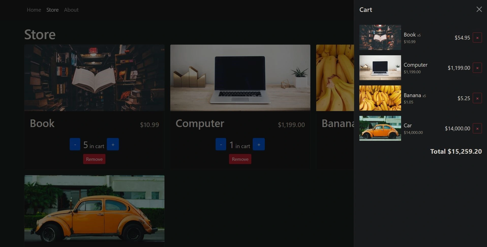

<div align="center">
    <a href="https://shoppingcart-react-fv.netlify.app" target="_blank">
      
    </a>
  <h3 align="center">Shopping Cart - React / TypeScript</h3>
</div>

##  <br /> 📋 <a name="table">Table of Contents</a>

- ✨ [Introduction](#introduction)
- ⚙️ [Tech Stack](#tech-stack)
- 📝 [Features](#features)
- 🚀 [Quick Start](#quick-start)

##  <br /> <a name="introduction">✨ Introduction</a>

**[EN]** A fully functional shopping cart built from scratch using React, TypeScript, and Bootstrap. This project incorporates local storage to persist cart data, demonstrating essential techniques and best practices for creating a robust and efficient shopping cart. It's an excellent intermediate-level project for web developers.

**[FR]** Un panier d'achat entièrement fonctionnel construit de zéro avec React, TypeScript et Bootstrap. Ce projet utilise le local storage pour conserver les données du panier, illustrant les techniques essentielles et les meilleures pratiques pour créer un panier d'achat robuste et efficace. C'est un excellent projet de niveau intermédiaire pour les développeurs web.

##  <br /> <a name="tech-stack">⚙️ Tech Stack</a>

- **React** is a popular JavaScript library for building user interfaces, particularly single-page applications where data changes over time. React's component-based architecture allows developers to create reusable UI components, making development more efficient and the codebase easier to maintain. 

- **TypeScript** is a statically typed superset of JavaScript that allows for early detection of errors and more robust, maintainable code. TypeScript's type system helps developers catch mistakes early during the development process, ensuring a more stable and reliable application.

- **Vite** is a modern front-end build tool that offers a fast and efficient development environment. It leverages ES modules for quick build times and features hot module replacement (HMR) for instant updates, making it ideal for frameworks like React, Vue, and Svelte. Vite's minimal configuration helps streamline development workflows.

- **Bootstrap** is a popular front-end framework for developing responsive and visually appealing web interfaces. It provides a collection of pre-designed components and a responsive grid system that simplifies the creation of mobile-first websites. Bootstrap's extensive documentation and customizable styles help developers quickly build and maintain consistent and professional-looking user interfaces.

- **Local Storage** is a web storage feature that allows web applications to store data persistently in the user's browser. It provides a simple key-value store with a straightforward API, enabling developers to save data across browser sessions without expiration. Local Storage is ideal for storing user preferences, session data, and other non-sensitive information. Its synchronous API makes it easy to use, though it is limited to storing string data only and has a size limit of around 5MB per domain.

## <br /> <a name="quick-start">🚀 Quick Start</a>

Follow these steps to set up the project locally on your machine.

<br/>**Prerequisites**

Make sure you have the following installed on your machine:

- [Git](https://git-scm.com/)
- [Node.js](https://nodejs.org/en)
- [npm](https://www.npmjs.com/) (Node Package Manager)

<br/>**Cloning the Repository**

```bash
git clone {git remote URL}
```

<br/>**Installation**

Let's install the project dependencies, from your terminal, run:

```bash
npm install
# or
yarn install
```


<br/>**Running the Project**

Installation will take a minute or two, but once that's done, you should be able to run the following command:

```bash
npm run dev
# or
yarn dev
```

Open [`http://localhost:5173`](http://localhost:5173) in your browser to view the project.